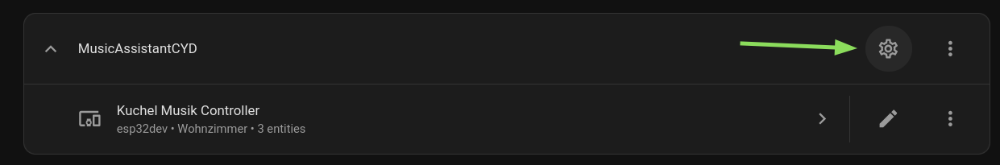
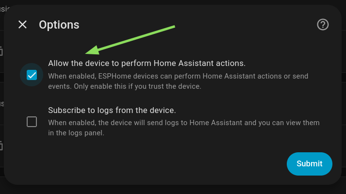
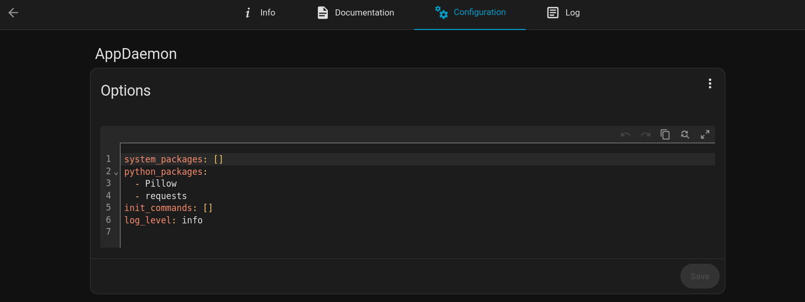
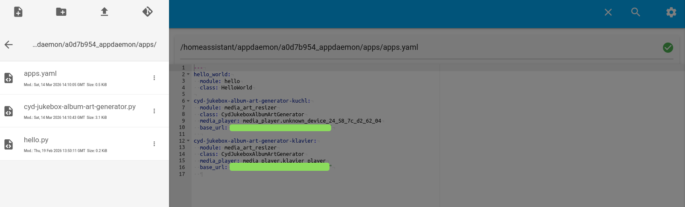

# Installation

There are two essential steps to get this working: **Configuring and flashing ESPHome** and **Setting up AppDaemon** to generate a scaled-down version of the song thumbnail for the cyd-jukebox. This is needed because the ESP on the CYD does not have enough RAM for the full-scale image.

> **Note:** If your ESP has extra PSRAM, you can skip the AppDaemon step and render the full image instead — just enter the image URL directly in the `online_image` config.

**Overview:**

1. Clone or download this repo
2. **ESPHome**
   - Adjust the config and fill in your credentials
   - Flash ESPHome onto the CYD
   - Add it to HA and enable "Allow this device to execute actions"
3. **Album Cover Image (AppDaemon)**
   - Install the AppDaemon add-on in HA
   - Add the required Python libraries to the add-on config
   - Add the script from `appdeamon/` to AppDaemon
   - Restart the add-on and verify it's working

---

## ESPHome

### Configuring your Jukebox

Head to the `esphome/` folder:

- Copy `config.yaml.example` and rename it to `config.yaml`
- Copy `secrets.yaml.example` and rename it to `secrets.yaml`

Open `config.yaml` and replace the example values with your own. The device name and friendly name can be chosen freely.

Open `secrets.yaml` and replace the example values with your WiFi credentials, API key, and Home Assistant token.

### Flashing

There are two ways to flash the config: locally via the command line, or through the ESPHome Device Builder add-on. If you're comfortable with Python, the local method is recommended.

#### Method 1: Locally

[Install ESPHome locally](https://esphome.io/guides/installing_esphome/), then plug in your CYD and make sure you can establish a serial connection (you may need to install UART drivers for your OS).

Navigate to the `esphome/` directory and run:

```bash
cd esphome
esphome run cyd-jukebox.yaml
```

When prompted with `Found multiple options for uploading, please choose one:`, select the USB Serial option.

Done. Easy as cake.

> **Tip:** You can run `esphome run` again later to update the device over-the-air — no USB needed after the first flash.

#### Method 2: ESPHome Device Builder

> **Before continuing:** You'll need to copy the config values from `esphome/config.yaml` into `esphome/cyd-jukebox-FULL.yaml` manually. At the top of that file there is a `substitutions` section — replace it with the one from your `config.yaml`. This ensures you're using your own values, not the example placeholders.

[Set up the ESPHome Device Builder add-on](https://esphome.io/guides/getting_started_hassio/), then:

1. Create a new empty device config inside ESPHome Device Builder
2. Edit the YAML — remove anything pre-filled
3. Paste the full contents of `esphome/cyd-jukebox-FULL.yaml`
4. Save
5. Add your secrets: click **Secrets** (top right) and enter the values from `esphome/secrets.yaml`
6. Connect your CYD via USB
7. Compile and upload

Your CYD should now boot, connect to WiFi, and display something.

### Add to Home Assistant and grant permissions

Head to **Settings → Devices & Services**. The CYD should be auto-discovered — if not, open the ESPHome integration and add it manually. The device displays its IP in the logs once it connects to WiFi.

Once added, go back to **Settings → Devices & Services → ESPHome**, find your cyd-jukebox in the device list, click the gear icon, and enable **"Allow the device to perform Home Assistant Actions"**.




The device is now operational.

## Optional: Curate your Playlists Page

The playlist page offers a way to start playing one of your personally curated playlists.
To do that, head over to `esphome/cyd-playlists-page.yaml` if you flashed it locally, or find the `Scrollable playlist list` Section in your ESPHome Device Builder yaml config.

Follow the steps outlined there to add your own playlists

## Appdeamon (for the cover art)

My motivation for writing is sadly gone at this point, so I had the AI write me this part. I verified that it is accurate. You do not necessarily have to run Appdeamon, any way of running the media_resizer.py script and making the resulting image available online works in theory. In that case, you have to adjust the `url` key of the `online_image` config in the esphome config accordingly

Here is the revised reference document, with the hardcoded path removed, proper official links added, and a dedicated section on the HA OS path quirk.

---

For writing the cyd-jukebox Installation Guide — AppDaemon section\_

---

### What this component does

An AppDaemon app running inside Home Assistant that:

- Watches a `media_player` entity for track changes (`media_title`, `entity_picture`, `entity_picture_local`)
- Downloads the album artwork (from Spotify CDN or the local HA media proxy)
- Resizes it to **64×64 JPEG** (the maximum an ESP32 without PSRAM can decode)
- Saves it to HA's `www` folder, making it available at `/local/[media player entity]-media_thumb.jpg`

---

### Step 1 — Install the AppDaemon add-on

AppDaemon is a community add-on for Home Assistant, not a built-in integration. [github](https://github.com/hassio-addons/addon-appdaemon/blob/main/appdaemon/DOCS.md)

1. Go to **Settings → Add-ons → Add-on Store**
2. Search for **"AppDaemon 4"** and install it
3. Do **not** start it yet — configure it first

> 📖 Official add-on docs: [github.com/hassio-addons/addon-appdaemon](https://github.com/hassio-addons/addon-appdaemon/blob/main/appdaemon/DOCS.md)

> ℹ️ The add-on is pre-configured to connect to HA automatically. You do **not** need to set `ha_url` or create a long-lived access token — despite what the official AppDaemon docs say. The add-on handles this via `!env_var SUPERVISOR_TOKEN`. [github](https://github.com/hassio-addons/addon-appdaemon/blob/main/appdaemon/DOCS.md)

---

### Step 2 — Add Python packages to the add-on

The add-on config (reachable via the add-on's **Configuration** tab in the HA UI, under the "Options" section) supports installing extra Python packages. Add `Pillow` and `requests`: [github](https://github.com/hassio-addons/addon-appdaemon/blob/main/appdaemon/DOCS.md)

```yaml
log_level: info
python_packages:
  - Pillow
  - requests
```



Save, then start (or restart) the add-on. It will install these on first boot.

> 📖 More on `python_packages`: [AppDaemon Community Add-on docs → Options](https://github.com/hassio-addons/addon-appdaemon/blob/main/appdaemon/DOCS.md)

---

### Step 3 — Finding the AppDaemon config folder on HA OS

⚠️ **!This is the single most confusing part of the setup on Home Assistant OS!** ⚠️

#### The problem

AppDaemon's config files (`appdaemon.yaml`, `apps/`) are **not** stored in your main HA config folder. They live in a separate add-on config directory that is **not visible** in the File Editor by default. [github](https://github.com/AppDaemon/appdaemon/issues/1881)

#### Where it actually is

The add-on config lives under `/addon_configs/<addon-slug>/` on the host. The slug for AppDaemon 4 is different per installation — you can find yours by running this in an SSH terminal:

```bash
find / -name "appdaemon.yaml" 2>/dev/null
```

This will return something like `/addon_configs/a0d7b954_appdaemon/appdaemon.yaml` — the path with the slug is specific to your installation.

#### How to access it

**Option A — Disable "Enforce Basepath" in File Editor:**

1. Go to **Settings → Add-ons → File Editor → Configuration**
2. Turn off **"Enforce Basepath"**
3. Restart File Editor
4. You can now navigate to `/addon_configs/<your-slug>/`

**Option B — Symlink it (recommended for convenience):**
Run this in your SSH terminal, replacing the slug with yours:

```bash
ln -s /addon_configs/<your-appdaemon-slug> /homeassistant/appdaemon
```

After this, `/homeassistant/appdaemon/` in File Editor points directly to AppDaemon's config. [github](https://github.com/hassio-addons/addon-appdaemon/issues/361)

#### Path mapping summary

| What you see in File Editor              | What AppDaemon sees at runtime                |
| ---------------------------------------- | --------------------------------------------- |
| `/homeassistant/`                        | `/homeassistant/` (HA config root)            |
| `/homeassistant/www/`                    | `/homeassistant/www/` ← **write images here** |
| AppDaemon config (via symlink or direct) | `/config/` inside the add-on container        |

> ⚠️ Inside AppDaemon's Python code, HA's `www` folder is `/homeassistant/www/`, not `/config/www/`. The `/config/` path inside the add-on points to AppDaemon's own config, not to HA's config folder.

---

### Step 4 — File structure

Once set up, your AppDaemon folder should look like:

```
<appdaemon-config-dir>/
├── appdaemon.yaml       ← auto-generated, leave mostly as-is
└── apps/
    ├── apps.yaml        ← register your app here
    └── cyd-jukebox-album-art-generator.py  ← the app code
```

And the output image will be saved into to:

```
/homeassistant/www/
└── [media player entity]-media_thumb.jpg     ← auto-created, served as /local/[media player entity]-media_thumb.jpg
```

> 📖 AppDaemon app structure docs: [appdaemon.readthedocs.io → Writing Apps](https://appdaemon.readthedocs.io/en/latest/APPGUIDE.html)

---

### Step 5 — `apps.yaml`

Located in `<appdaemon-config-dir>/apps/apps.yaml`

Copy **the content of the file** found in this repo under `appdeamon/apps.py`

- `module` matches the filename (`cyd-jukebox-album-art-generator.py`) without the `.py` [appdaemon.readthedocs](https://appdaemon.readthedocs.io/en/4.5.2/APPGUIDE.html)
- `media_player` is the entity ID of your Music Assistant player
- `base_url` is your HA URL — needed to resolve local `/api/media_player_proxy/...` artwork URLs
- `output_file` is the filename under `/homeassistant/www/`

---

### Step 6 — `cyd-jukebox-album-art-generator.py`

Located in `<appdaemon-config-dir>/apps/cyd-jukebox-album-art-generator.py`

Copy the script found in this repo under `appdeamon/cyd-jukebox-album-art-generator.py`

AppDaemon **hot-reloads** the app automatically whenever you save changes to this file — no restart needed. [appdaemon.readthedocs](https://appdaemon.readthedocs.io/en/4.5.2/APPGUIDE.html)

---

### Step 7 — Start & verify

1. Restart the AppDaemon add-on (to install Pillow/requests)
2. Open the **AppDaemon add-on → Log tab** and confirm:
   ```
   INFO AppDaemon: Starting apps: ['cyd-jukebox-album-art-generator']
   INFO cyd-jukebox-album-art-generator: CYDJukeboxAlbumArtGenerator initialized for media_player.xxx
   INFO cyd-jukebox-album-art-generator: Saved 64x64 cover art to /homeassistant/www/[media player entity]-media_thumb.jpg
   ```
3. Open in a browser: `http://<your-ha-url>/local/[media player entity]-media_thumb.jpg`

---

### Multiple Devices

If you want to have multiple cyd-jukebox devices active, simply add the script multiple times to the apps.py file of appdeamon.



### Troubleshooting

| Symptom                                                 | Likely cause                                                                                        |
| ------------------------------------------------------- | --------------------------------------------------------------------------------------------------- |
| Only `hello_world` running, your app absent from web UI | `apps.yaml` in wrong folder, or app fails to load (check logs for errors)                           |
| `ImportError: No module named 'PIL'`                    | `python_packages` not saved or add-on not restarted after adding them                               |
| `No class CYDJukeboxAlbumArtGenerator found`            | Class name typo or wrong filename                                                                   |
| Image not updating on track change                      | Comment out the `chosen_new == chosen_old` guard temporarily to force-refresh on every state change |
| URL resolution fails                                    | Check `base_url` in `apps.yaml` matches your exact HA URL and port                                  |

To debug interactively, restart the add-on — it will run `initial_update` 5 seconds after boot and generate a thumbnail from whatever is currently playing.

---

## Reference links

| Topic                                                            | Link                                                                         |
| ---------------------------------------------------------------- | ---------------------------------------------------------------------------- |
| AppDaemon Community Add-on (install, `python_packages`, options) | https://github.com/hassio-addons/addon-appdaemon/blob/main/appdaemon/DOCS.md |
| AppDaemon App Writing Guide (structure, `apps.yaml`, args)       | https://appdaemon.readthedocs.io/en/latest/APPGUIDE.html                     |
| AppDaemon API Reference (`listen_state`, `fire_event`, `run_in`) | https://appdaemon.readthedocs.io/en/latest/AD_API_REFERENCE.html             |
| AppDaemon config location change in HA OS (v0.15+)               | https://github.com/AppDaemon/appdaemon/issues/1881                           |
| HA static files / `www` folder                                   | https://www.home-assistant.io/integrations/http/#hosting-files               |
| ESPHome HA API / `homeassistant` event platform                  | https://esphome.io/components/api.html                                       |
